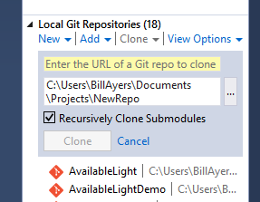
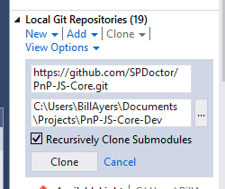
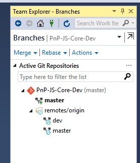
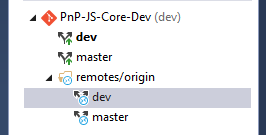

#Using Visual Studio 2015 with PnP-JS-Core#

If you prefer to use Visual Studio to the command-line tools because, for example, you are more comfortable in the VS tooling, you can use it to manage your local copy of a Git repository. Be aware that the build process uses command-line tools and there are no solution or project files, so Visual Studio isn't going to be a huge help if you want to build or test the project.

Open Visual Studio and go to the Team Explorer tab. Make sure you are connected to Github - if not click on Manage Connections and log in to GitHub.

Once logged in, you can click on Clone to get a local copy of a repository. You have two options depending on whether you want to make contributions. 

##Making a Copy of the Main Repository##

If you go to Local Git Repositories and select Clone there, you can add the URL of the Git repository for the PnP-JS-Core project. 

In our case that is https://github.com/OfficeDev/PnP-JS-Core.git which you can copy from the handy link copy button on the repository page, or you can simply add ".git" on to the end of the URL of the repo. After you paste the URL the local repository address is updated automatically.

Click on Clone to create your local git repository, which is a "clone" of the main repository in Github-speak. You will see the clone repository being created, which should only take a few seconds because this is not a particularly large repository. A link now appears in the list of local repositories:

Double-click the repo to open it in Team Explorer: You can click on Sync to make sure everything is up-to-date, or Actions->Open in File explorer. 

Generally the Visual Studio tooling gives a nice graphical interface for working with Git, although it is not the only choice. If you want to manage and edit the files you can just open them individually in the Visual Studio editor, or go to File->Open->Web Site… and then choose the directory containing the local repository (even though it is not a web site of course, Visual Studio treats it as a collection of files). You can then use the Visual Studio solution explorer and editor along with any tools you like (e.g. Intellisense, ReSharper, etc.).

##Making Changes##

If you want to start making changes you first need to fork the project.

Click on the Fork button on the repository page on the Github site and you will get a new repository created that is a copy but under your own account. You can clone this locally as well, using the same technique as described above. If you already cloned the main repository you will need to choose another name for the clone of your forked repository. The important difference is that you will have write access to this repo so you will be able to make changes and sync them up from your modified local repository.

After you click Clone you will see a new repository in the list, which you can open as before. Before you open it and start making changes be sure to switch from the *master* branch to the *dev* branch. Usually maintainers only accept pull requests (suggested sets of changes) that are made to the development branch. A common practice is to then periodically merge the dev branch into the master. Go to branches and double-click on the dev branch to switch.

You should then see that you are on the dev branch (in bold text).

Now you can start making changes. You should sync your local repository with your Github fork at frequent intervals, and use descriptive commit messages. Be sure to check that the project still builds and runs and passes all its tests. If you have added functionality make sure that you have also added automated tests where appropriate.

When you are ready to submit your changes, go to the Github page for your forked repository and click on the inviting green "New pull request" button. You will need to give the pull request a title and you also get to write a letter to the maintainers where you have an opportunity to explain what you have done, possibly in the hope of persuading them in the event that they are dubious about your changes.

Once your pull request is submitted it is just a case of waiting for a maintainer to look at your pull request. They may just accept the pull request, ask for clarification or changes, or possibly even reject it (although this is unlikely). You can see the status of outstanding pull requests by clicking on the button on the Github page for the repository.

##More Information##

Get started with the [Quick Start Guide](getting-started.md).

See how to [install the library in your project](getpnp.md).

[Learn about the API](api/readme.md).
